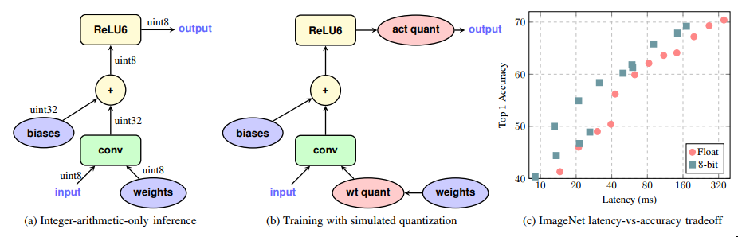
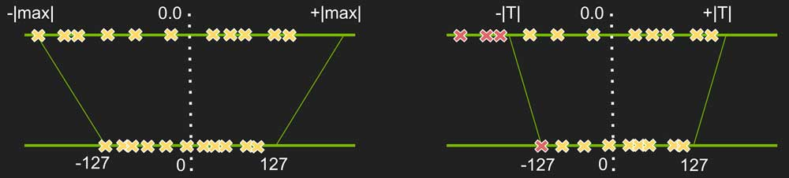
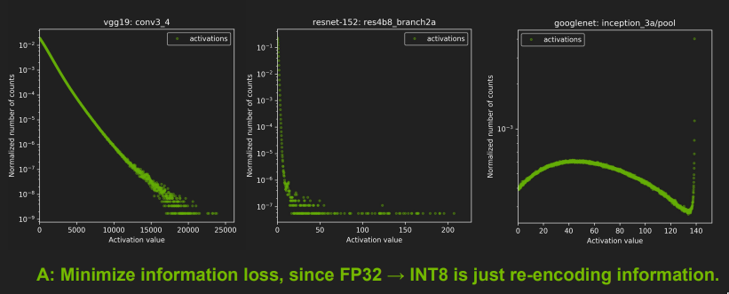
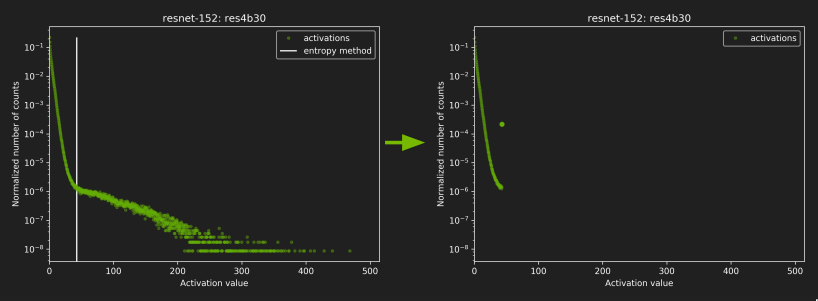
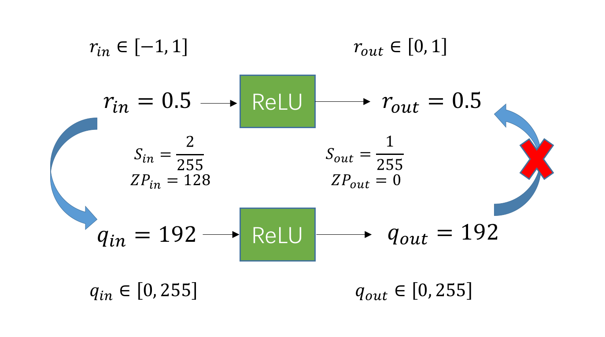

The post-training quantization code without any existing quantization tools


# Short Result

ResNet-50 for cifar10
- Based on google's paper [Quantization and Training of Neural Networks for Efficient Integer-Arithmetic-Only Inference](https://arxiv.org/abs/1712.05877)
- This is Post-training Static Quantization, the model is trained in fp32, quantized value still in fp32 format but min max values changed accordingly
- ResNet50 has really good generalization ability, the quantization accuracy of small models will be reduced even more 
- `4bit` means weights and activations all quantized into 4bit, however when inference: "All variables and computations are carried out using 32-bit floating-point arithmetic"
- The following table contains 3 differnet quantization approaches:
  - `built-in` refers to PyTorch built-in 8bit quantization, with layer fusion and Conv-BN-ReLU fold, in torch.qint8
  - `hist` refers to `HistogramObserver`, modified from PyTorch's source code, no fusion
  - `fake-hist` refers to a lite version of `HistogramObserver`, based on pre-set percentile, no fusion

| Quantization   | Accuracy |
| -------------- | -------- |
| fp32 original  |  93.62%  |
| 8bit built-in  |  93.62%  |
| 8bit hist      |  93.52%  |
| 8bit fake-hist |  93.41%  |
| 4bit hist      |  64.62%  |
| 4bit fake-hist |  88.55%  |
| 3bit fake-hist |  50.76%  |


## Project Structure and Re-produce

I am using google colab pro (2 core 4 thread Intel Xeon CPU, 12g ram or high-ram mode with 24g ram)
Change function get_CIFAR10(getdata=True) to download cifar-10 dataset

```
├── checkpoint
│   └── ResNet50_93.62_44.pt - Pre-trained ResNet50 cifar on GPU
├── data - the folder of data
├── ResNet50_cifar_built-in_quantize.ipynb - PyTorch built-in 8bit quantization
├── My_ResNet_Quantization.ipynb - Hand-write quantization
├── My_ResNet_Quantization.py - Hand-write quantization (python script version)
├── PyTorch Quantization.xmind - PyTorch quantization source code structure
└── README.md
```


# Background
[Quantization Resource Collection](https://jackwish.net/2019/neural-network-quantization-resources.html)
[Introduction to the quantification method of neural network model (Chinese)](https://chenrudan.github.io/blog/2018/10/02/networkquantization.html)


Two principal ways to do quantization:
- Post-training
  - Dynamic: LSTM
    - Weights quantization simply multiplies input by a scaling factor, then rounds the result
    - Activations quantization requires adjusting the scaling factor based on input
  - Static: CNN
- Quantization-aware training

## Int 8 vs Float 32
Check this link: [How to accelerate and compress neural networks with quantization](https://towardsdatascience.com/how-to-accelerate-and-compress-neural-networks-with-quantization-edfbbabb6af7)

|                  | Int 8       | uint8    | Float 32                                 |
| ---------------- | ----------- | -------- | ---------------------------------------- |
| Range            | [−128, 127] | [0, 255] | [(2 − 2^23) × 2^127, (2^23 − 2) × 2^127] |
| number of values | 2^8         | 2^8      | 2^32                                     |


## PyTorch Built-in Quantization Steps

- Train a model in floating point using GPU
- Prepare Quantization Model
  - Apply layer fusion (conv, bn, relu) in CPU eval mode
  - Add `QuantStub()`, `DeQuantStub()`
  - Set quantization configurations
- Run post-training calibration
  - `torch.quantization.prepare`
  - Feed in data
  - Model still in floating point so far
- Convert to quantized integer model


# Questions

The following answers are based on `My_ResNet_Quantization.ipynb`, 

## Explain the dataflow of one complete convolution layer in your neural network
- It should include convolution, activation, and de-quantization steps
- Explain the bit-accuracy at each step

### Dataflow of Conv-BN-ReLU
Data flow can be found on google's paper _Quantization and Training of Neural Networks for Efficient Integer-Arithmetic-Only Inference_:


The first 3 layer of ResNet50:
```
(conv1): Conv2d(3, 64, kernel_size=(3, 3), stride=(1, 1), padding=(1, 1), bias=False)
  conv1.weight torch.Size([64, 3, 3, 3])
(bn1): BatchNorm2d(64, eps=1e-05, momentum=0.1, affine=True, track_running_stats=True)
  bn1.weight torch.Size([64])
  bn1.bias torch.Size([64])
(relu): ReLU(inplace=True)
```

Process quantization and de-quantization requires `scale` and `zero-point`, assume we already got these values after calibration

We need first quantized input data and weights in to n bit. Convolution requires multiplication and addition, the 8bit value * 8bit value may result in a bigger value that int8 cannot present. According to google's paper, they do the calculation in higher bits, then quantize the result into 8 bit before sending to ReLU layer ("computations are carried out using 32-bit floating-point arithmetic"). Activation (ReLU) will set the values less than 0 to 0.

Specifically our input image is 3 channels color images of 32x32 pixels in size, output has 64 channels. BatchNorm after Conv means we don't need bias for the Conv layer


### How to further increase the accuracy
Conv-BN-ReLU Quantize layer fusion, since ReLU itself does not do any mathematical operations, it is just a truncation function, it's possible to merge them into one single layer. Here's code:

[Quant-Conv-BN-ReLU](https://github.com/Jermmy/pytorch-quantization-demo/blob/e075b87745aa782b6961dba752b3bf06a03e5702/module.py#L288)
[Folding BN ReLU (Chinese)](https://jermmy.github.io/2020/07/19/2020-7-19-network-quantization-4/)

Also, according to that repo, if we need to perform quantize multiplication, some parameters can be pre-calculated to improve inference speed. Check `freeze` function in that repo.


## Show one example of how you quantize one layer of weights to 8-bit
- explain how you do the quantization here
- and what is the trade-off

Generally speaking, to map 
$$
x \in [a, b] 
\to 
x_q \in [a_q, b_q]
$$

**Quantize**
$$
x_q = \text{round}\big(\frac{1}{s} x - z\big)
$$

**DeQuantize**
$$
x = s (x_q + z)
$$

**To calculate s and z:**
[1] relationship between boundaries
$$
a = s (a_q + z)

\\b = s (b_q + z)
$$

[2] 0 in fp32 should be 0 in int8
$$
z = \text{round} (\frac{1}{s} 0 + z) = \text{round} (z)
$$

In project, quantization and dequantization can be found in function called "Quantize":
- it first calculate the upper and lower value based on quantized bit we want (for example, 8bit)
- quantize and dequantizate defined as:
    ```python
    output = (torch.clamp(self.round(input / self.scale - self.zero_point),
                          self.quant_min_val, self.quant_max_val) \
                + self.zero_point) * self.scale
    ```

- To improve accuracy, I am using "MinMaxObserver" to determind the range of fp32 to be quantized for weight values
  - Feed data to a layer, Observer will find the optimal min and max value
  - Check page 18 and page 28: [NVIDIA 8-bit Inference with TensorRT](https://on-demand.gputechconf.com/gtc/2017/presentation/s7310-8-bit-inference-with-tensorrt.pdf)




## Show one example of how you quantize input/output of one convolution layer to 8-bit
- explain how you do the quantization here
- and how do you minimize the error

That requires Calibration for activation quantization, the reason is similar to weight quantization, The figure below from NVIDIA shows that a smaller number density will occupy a larger value range:




### HistogramObserver

The first one is from PyTorch's official repo:

Steps (according to PyTorch source code):
1. Create the histogram of the incoming inputs.
    The histogram is computed continuously, and the ranges per bin change with every new tensor observed.
2. Search the distribution in the histogram for optimal min/max values.
    The search for the min/max values ensures the minimization of the quantization error with respect to the floating point model.
3. Compute the scale and zero point

The 'error' is calculated based on density and norm when choosing specific bins from histogram. Check `HistogramObserver.compute_quantization_error` in Notebook.
During the calibration, it will find the optimal start and end range to quantize

### FakeHistogramObserver
Manually assign a percentage to avoid the searching method. Simply use `torch.kthvalue` to determine the value,works surprisingly well in low bit situations


# Optional Questions

## Can you quantize the NN to 6-bit or even lower? What would be the concern? 
Potential concerns include the number of values dramatically reduced in low bit scenario (2^6 = 64), the situations become even worse when performing multiplication. 

One solution is to use high-bit value to save the calculation results. Also, weight quantization and activation quantization are not equally sensitive in low-bit scenarios, so mix-bit quantization is an option.

The problem with those binary networks is that they are only fancy in research, but cannot be widely used in industry.


## If we apply quantization before and after the activation (one 8-bit quantization at the output of convolution, another 8-bit quantization at the output of activation), what will be the impact on final accuracy? 
The problem is at scale and zero point, you need to make sure that the scale and zero point before and after quantization are the same:


That's part of the reason why we merge Conv-BN-ReLU

